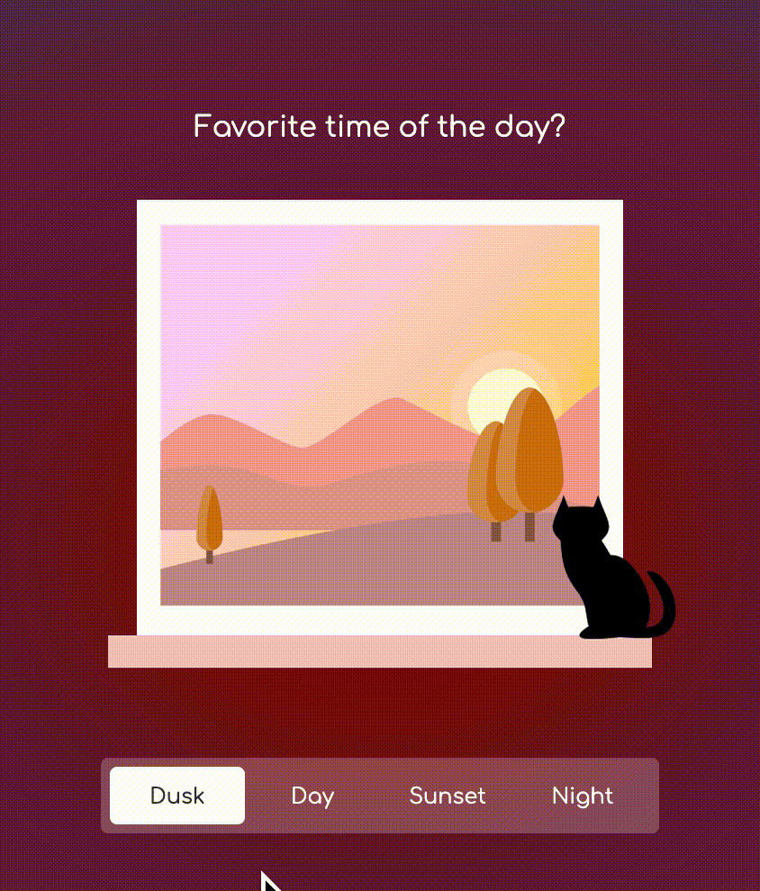

# css-animation-cypress-example

> Example showing how Cypress stops CSS animations

Read the blog post [How Cypress Freezes CSS Animations And You Can Too](https://glebbahmutov.com/blog/css-animations/)

The CSS example comes from the Codepen [CSS Animation: Time of Day](https://codepen.io/oliviale/pen/ELPvLM) by Olivia Ng. To play it, just open the [public/index.html](./public/index.html) in your browser and click the time of the day buttons.
